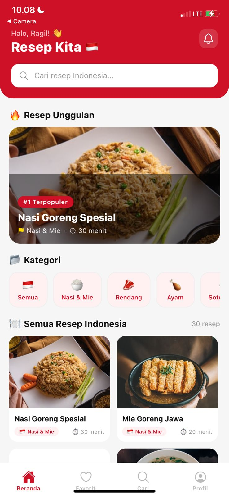
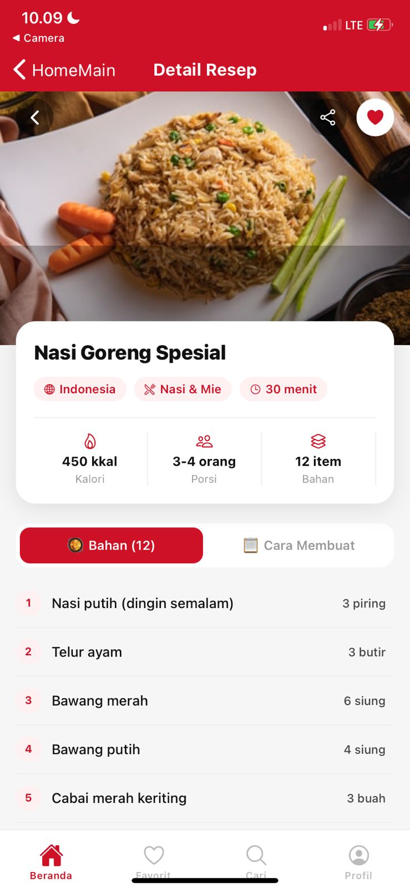
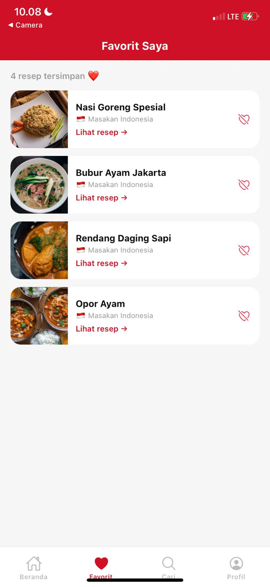
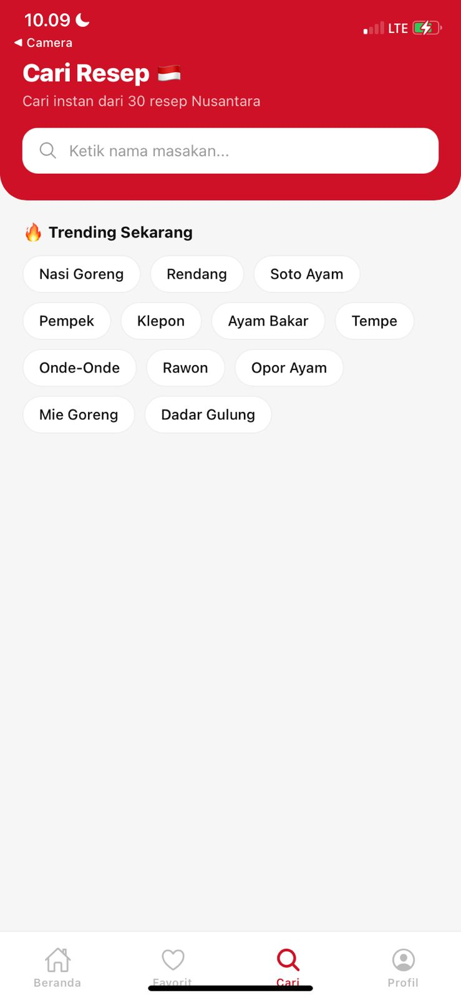
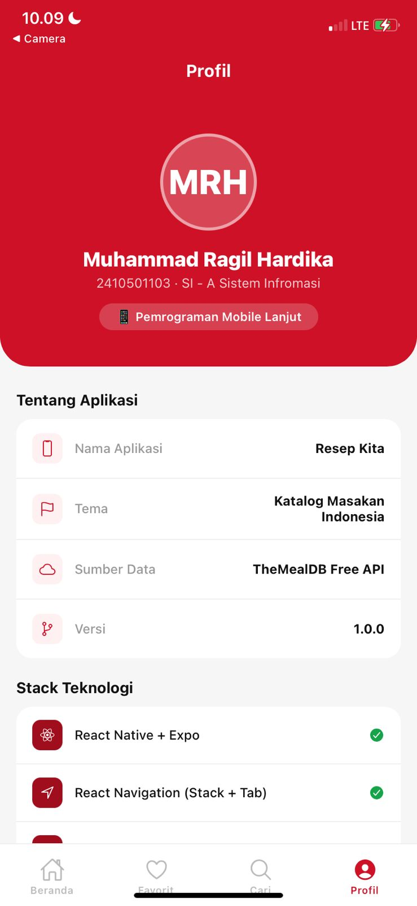

# ResepKita App

## Identitas

- Nama: Muhammad Ragil Hardika
- NIM: 2410501103
- Kelas: C

## Tema

Tema A: Resep Kita (katalog resep)

## Tech Stack

- React Native (Expo)
- React Navigation
- Context API
- Fetch API

## Cara Menjalankan

```bash
git clone [https://github.com/raGilGithub/uts-mobile-lanjut-2410501103-MuhammadRagilHardika]
cd resep-kita
npm install
npx expo start
```

## Screenshot

### Home Screen



### Detail Screen



### Favorites Screen



### Search Screen



### About Screen



## Video Demo


## State Management

Pada aplikasi ini saya menggunakan Context API untuk mengelola state favorit. Context API dipilih karena lebih sederhana dan ringan dibandingkan Redux, serta sudah cukup untuk kebutuhan aplikasi ini yang hanya memerlukan penyimpanan data favorit secara global. Dengan Context API, data favorit dapat diakses oleh beberapa screen tanpa perlu melakukan props drilling.

## Referensi

- https://reactnative.dev/

- https://docs.expo.dev/

- https://reactnavigation.org/

- https://www.themealdb.com/api.php

- https://stackoverflow.com/

- https://youtu.be/3NaTLy94PzU?si=2LCxKibdnx-VO3WP

- https://youtu.be/VtfrOPuW6LY?si=entBogC7dWVk7rgT

- ChatGPT (OpenAI)

- Claude AI (Anthropic)

## Refleksi

Dalam pengerjaan proyek ResepKita ini, saya mengalami beberapa kesulitan terutama dalam memahami alur navigasi menggunakan React Navigation dan pengelolaan state antar screen. Awalnya saya cukup bingung dalam menghubungkan antar screen seperti Home ke Detail serta mengatur parameter yang dikirimkan. Selain itu, saya juga mengalami error saat mengambil data dari API, terutama terkait dengan penanganan error dan loading state.

Saya juga sempat mengalami kendala dalam menampilkan gambar dari API, terutama ketika path gambar tidak sesuai atau terjadi error saat load image. Namun setelah mencoba beberapa solusi, saya berhasil memperbaikinya dengan menggunakan data langsung dari API.

Dari proyek ini saya belajar bagaimana membuat aplikasi mobile sederhana menggunakan React Native dan Expo, mengintegrasikan API eksternal, serta mengelola state menggunakan Context API. Saya juga belajar pentingnya debugging dan membaca error message untuk menemukan solusi. Secara keseluruhan, proyek ini menambah pemahaman saya dalam pengembangan aplikasi mobile.
